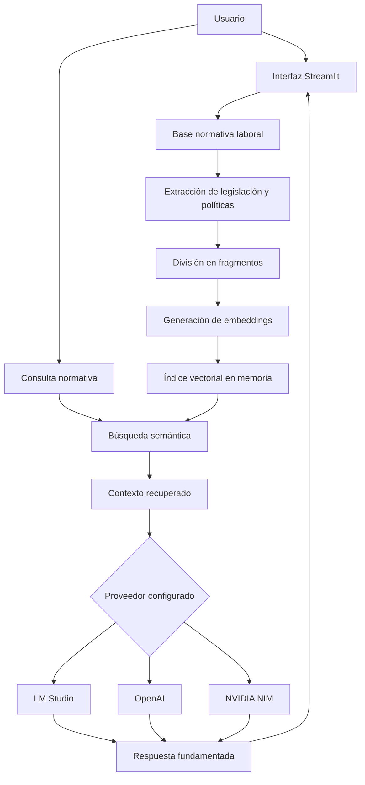

# Base de Conocimiento Normativo Laboral de Panamá

Aplicación web especializada en **legislación y políticas laborales fundamentales de la República de Panamá**, desarrollada con Retrieval-Augmented Generation (RAG) y LangChain.

El sistema permite consultar una base normativa en lenguaje natural, recuperar los fragmentos pertinentes y responder con referencias al archivo y página utilizados. Puede funcionar con modelos locales mediante **LM Studio** o con las API de **OpenAI** y **NVIDIA NIM**.

> **Aviso:** las respuestas son informativas y dependen de los documentos incorporados. El sistema no sustituye asesoría legal profesional ni garantiza por sí solo que una norma continúe vigente.

## Características

- Carga múltiple de archivos PDF, DOCX, TXT y Markdown.
- Lectura automática de legislación y políticas almacenadas en el repositorio.
- Indicador visible del número de normas disponibles y su estado de indexación.
- Respuestas limitadas al fundamento documental recuperado.
- Referencias al instrumento, archivo y página utilizados.
- Advertencias cuando el contenido no permite confirmar vigencia o responder un caso.
- Compatibilidad con LM Studio, OpenAI y NVIDIA NIM.
- Cambio de proveedor desde un panel administrativo protegido.
- Claves, modelos y endpoints ocultos para los usuarios públicos.
- Contraseña administrativa almacenada mediante hash PBKDF2-SHA256.
- Configuración privada excluida automáticamente de Git.
- Interfaz web desarrollada con Streamlit.
- Contenedor Docker incluido.
- Código modular preparado para migrar a FastAPI y una base vectorial persistente.

## Tecnologías

| Tecnología | Función |
| --- | --- |
| Python 3.12 | Lenguaje principal recomendado |
| Streamlit | Interfaz web, carga de archivos y chat |
| LangChain | Orquestación del flujo RAG |
| LangChain OpenAI | Conexión con OpenAI y LM Studio |
| LangChain NVIDIA AI Endpoints | Conexión con NVIDIA NIM |
| InMemoryVectorStore | Almacenamiento vectorial de la versión inicial |
| PyPDF | Extracción de texto de archivos PDF |
| python-docx | Lectura de documentos Word |
| python-dotenv | Carga de variables privadas desde `.env` |
| PBKDF2-SHA256 | Protección de la contraseña administrativa |
| Docker | Empaquetado y despliegue de la aplicación |
| Pytest | Pruebas automatizadas |

## Diagrama de flujo



## Arquitectura del proyecto

```text
agente-rag/
├── app.py                         # Interfaz Streamlit y panel administrativo
├── generar_clave_admin.py         # Generador de hash para el administrador
├── src/
│   └── rag/
│       ├── __init__.py
│       ├── admin.py               # Autenticación y configuración privada
│       ├── config.py              # Validación de proveedores
│       ├── documents.py           # Lectura de PDF, DOCX, TXT y MD
│       ├── providers.py           # LM Studio, OpenAI y NVIDIA
│       └── service.py             # Indexación, recuperación y respuesta
├── tests/
│   └── test_documents.py
├── data/
│   └── documentos_base/           # Legislación y políticas laborales
├── docs/
│   └── DECISIONES.md
├── .streamlit/
│   ├── config.toml
│   └── secrets.toml.example
├── .env.example
├── requirements.txt
├── pytest.ini
├── Dockerfile
└── README.md
```

## Requisitos

- Python 3.11 o 3.12.
- `pip` actualizado.
- LM Studio si se utilizarán modelos locales.
- Una clave de OpenAI o NVIDIA si se utilizarán sus respectivas API.

Se recomienda evitar Python 3.13 cuando alguna dependencia todavía no disponga de una versión compatible.

## Instalación

Clona el repositorio y entra en la carpeta:

```bash
git clone https://github.com/ijimenez08/agentes_rag.git
cd agentes_rag
```

Crea y activa un entorno virtual:

```bash
python3.12 -m venv .venv
source .venv/bin/activate
```

En Windows PowerShell:

```powershell
py -3.12 -m venv .venv
.venv\Scripts\Activate.ps1
```

Instala las dependencias:

```bash
python -m pip install --upgrade pip
python -m pip install -r requirements.txt
```

## Variables de entorno

Copia el archivo de ejemplo:

```bash
cp .env.example .env
```

En Windows:

```powershell
Copy-Item .env.example .env
```

Configura únicamente los proveedores que utilizarás:

```env
# Administración
ADMIN_USERNAME=tu_usuario
ADMIN_PASSWORD_HASH=tu_hash_pbkdf2

# Proveedor inicial: local, openai o nvidia
RAG_PROVIDER=local
RAG_CONFIG_PATH=.runtime/private_config.json

# LM Studio
LM_STUDIO_BASE_URL=http://localhost:1234/v1
LM_STUDIO_API_KEY=lm-studio
LM_STUDIO_CHAT_MODEL=identificador-del-modelo-chat
LM_STUDIO_EMBEDDING_MODEL=identificador-del-modelo-embeddings

# OpenAI
OPENAI_API_KEY=
OPENAI_CHAT_MODEL=gpt-4.1-mini
OPENAI_EMBEDDING_MODEL=text-embedding-3-small

# NVIDIA
NVIDIA_API_KEY=
NVIDIA_BASE_URL=https://integrate.api.nvidia.com/v1
NVIDIA_CHAT_MODEL=nvidia/nemotron-3-ultra-550b-a55b
NVIDIA_EMBEDDING_MODEL=nvidia/nv-embedqa-e5-v5
```
## Crear o cambiar la contraseña administrativa

La contraseña no se guarda directamente. Genera su hash con:

```bash
python generar_clave_admin.py
```

El programa solicitará una contraseña con al menos 12 caracteres y devolverá:

```env
ADMIN_PASSWORD_HASH=pbkdf2_sha256$...
```

Copia la línea completa al archivo `.env` y reinicia la aplicación.

## Ejecución

```bash
python -m streamlit run app.py
```

La aplicación estará disponible normalmente en:

```text
http://localhost:8501
```
## Uso

### Base normativa permanente

Guarda la legislación y las políticas laborales que debe consultar el agente dentro de:

```text
data/documentos_base/
```

La lectura es recursiva, por lo que puedes organizarlos en subcarpetas. Se admiten PDF, DOCX, TXT y Markdown:

```text
data/documentos_base/
├── codigo_trabajo/
├── leyes/
├── decretos_y_reglamentos/
├── resoluciones/
├── politicas_laborales/
└── reformas_y_actualizaciones/
```

Al abrir la aplicación, la normativa permanente se carga e indexa automáticamente. La interfaz muestra cuántos archivos están almacenados, permite ver sus nombres y confirma cuándo la base está lista.

Los archivos subidos por el usuario también se incorporan automáticamente. El botón **Actualizar base normativa** permite forzar una nueva indexación si modificas la documentación o necesitas reintentar una carga.

Si el repositorio es público, los documentos almacenados en esta carpeta también serán públicos. No incluyas información confidencial ni datos personales.

### Usuario público

1. Revisa la normativa disponible o agrega documentos autorizados.
2. Espera la confirmación **Base normativa lista**.
3. Escribe una consulta sobre legislación o políticas laborales de Panamá.
4. Revisa la respuesta y las fuentes recuperadas.

El usuario público no puede visualizar el proveedor, la clave API, los modelos ni las URLs internas.

### Ejemplos de consultas

- ¿Qué establece el documento sobre este derecho u obligación laboral?
- ¿En qué artículo o sección se fundamenta la respuesta?
- ¿Qué requisitos aparecen en la normativa cargada para este procedimiento?
- ¿Los documentos mencionan excepciones o condiciones especiales?
- ¿Qué aspectos no pueden confirmarse con la base normativa disponible?
- Compara lo establecido en dos instrumentos incluidos en la base.

### Administrador

1. Abre **🔒 Administración** en la barra lateral.
2. Inicia sesión.
3. Selecciona el proveedor activo.
4. Configura el modelo de chat, embeddings y URL base.
5. Escribe una nueva clave únicamente cuando quieras reemplazar la actual.
6. Pulsa **Guardar configuración**.
7. Actualiza nuevamente la base normativa.

Los cambios se guardan localmente en `.runtime/private_config.json` con permisos restringidos.

## Configuración de LM Studio

1. Descarga un modelo de chat.
2. Descarga un modelo de embeddings.
3. Entra en **Developer** y activa **Start Server**.
4. Carga ambos modelos.
5. Verifica la URL `http://localhost:1234/v1`.
6. Copia los identificadores exactos de los modelos al panel administrativo.

Puedes comprobar los modelos cargados con:

```bash
curl http://localhost:1234/v1/models
```

LM Studio expone endpoints compatibles con OpenAI, por lo que se utiliza `ChatOpenAI` y `OpenAIEmbeddings` cambiando la URL base.

## Configuración de OpenAI

1. Genera una clave en la plataforma de OpenAI.
2. Guárdala como `OPENAI_API_KEY` o introdúcela desde el panel administrativo.
3. Selecciona **API de pago · OpenAI**.
4. Guarda la configuración y procesa nuevamente los documentos.

El uso de esta opción puede generar cargos según el modelo y el volumen procesado.

## Configuración de NVIDIA NIM

1. Entra en [NVIDIA API Catalog](https://build.nvidia.com/).
2. Inicia sesión y abre **API Keys**.
3. Genera una clave; normalmente comienza con `nvapi-`.
4. Guárdala como `NVIDIA_API_KEY` o introdúcela desde el panel administrativo.
5. Copia el identificador exacto del modelo desde su página en el catálogo.

El proyecto utiliza las integraciones oficiales de LangChain [`ChatNVIDIA`](https://docs.langchain.com/oss/python/integrations/chat/nvidia_ai_endpoints) y [`NVIDIAEmbeddings`](https://docs.langchain.com/oss/python/integrations/embeddings/nvidia_ai_endpoints).

## Docker

Construye la imagen:

```bash
docker build -t agente-rag .
```

Ejecuta el contenedor:

```bash
docker run --rm -p 8501:8501 --env-file .env \
  -v "$(pwd)/.runtime:/app/.runtime" agente-rag
```

Para acceder desde Docker a LM Studio ejecutado en el equipo anfitrión:

```env
LM_STUDIO_BASE_URL=http://host.docker.internal:1234/v1
```

En Linux puede ser necesario agregar:

```bash
--add-host=host.docker.internal:host-gateway
```

## Pruebas

```bash
python -m pip install pytest
python -m pytest -q
```

## Seguridad

- Las claves no se incluyen en el código fuente.
- La contraseña administrativa se verifica mediante PBKDF2-SHA256.
- La interfaz pública no muestra datos técnicos de las API.
- Los errores detallados solo se presentan en sesiones administrativas.
- La configuración privada está excluida de Git.
- Los archivos deben validarse nuevamente antes de utilizar la aplicación en un entorno empresarial.
- Debe añadirse limitación de intentos, HTTPS y autenticación centralizada para una publicación de producción.

El archivo `.runtime/private_config.json` puede contener claves guardadas desde el panel. No debe copiarse al repositorio, compartirse ni incluirse en imágenes Docker.

## Limitaciones actuales

- El índice vectorial permanece en memoria.
- Cada nueva sesión puede requerir la generación del índice vectorial en memoria.
- Los PDF escaneados requieren OCR y no se procesan todavía.
- El almacenamiento local de configuración no se comparte entre varias réplicas.
- Streamlit Community Cloud no garantiza persistencia permanente del archivo `.runtime/private_config.json`.

## Escalamiento futuro

- Sustituir `InMemoryVectorStore` por PostgreSQL con pgvector o Qdrant.
- Guardar archivos en S3 o almacenamiento compatible.
- Separar el backend mediante FastAPI.
- Ejecutar la indexación mediante Celery, RQ o una cola administrada.
- Incorporar autenticación por usuario y separación por `tenant_id`.
- Guardar secretos en Vault, AWS Secrets Manager, Google Secret Manager o equivalente.
- Añadir métricas de latencia, costo y calidad de recuperación.
- Incorporar OCR para documentos escaneados.
- Agregar evaluación automática de respuestas y recuperación.

## Solución de problemas

### No se encuentra un módulo

Instala nuevamente las dependencias dentro del entorno virtual:

```bash
source .venv/bin/activate
python -m pip install -r requirements.txt
```

### NVIDIA no está instalado

```bash
python -m pip install langchain-nvidia-ai-endpoints
```

### LM Studio indica que no hay modelos cargados

Abre **Developer**, inicia el servidor y carga tanto el modelo de chat como el modelo de embeddings.

### El PDF no devuelve contenido

El archivo probablemente contiene imágenes escaneadas. Esta versión utiliza extracción de texto y todavía no incorpora OCR.

## Licencia

Antes de publicar el repositorio, agrega el archivo `LICENSE` con la licencia elegida. Para un proyecto abierto sencillo puede utilizarse MIT, siempre que las licencias y condiciones de uso de los modelos seleccionados sean compatibles.

## Enfoque del proyecto

Proyecto desarrollado como base escalable para consulta documental de legislación y políticas laborales fundamentales de la República de Panamá.

## Capturas y ejecucion

### Modo local 


### Modo Web con streamlit

https://agentesrag-prxhhkx3gwyzzhy6hzmp4h.streamlit.app

## comentarios

por seguridad la api de nvidia no esta disponible, te recomiendo que accedas al panel de configuracion para que puedas colocar la api directamente.

para acceder en la web te dejo el usuario que es "admin_rag" y pass "abc123456789", sin tu llave api no funciona el modelo, puedes ejecutarlo en local.


